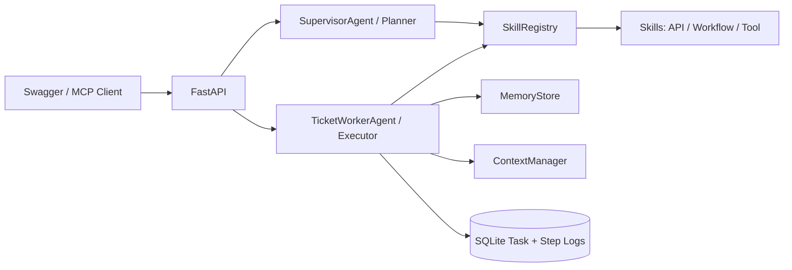

# Agentic Ticket Worker

一个面向母婴/客服工单场景的执行型 Agent / 数字员工 Demo。

它的目标不是做普通 RAG 问答，而是展示一个可执行任务链路：

`Task -> Planning -> Progressive Context -> Skill/Tool Call -> ReACT Trace -> Human Approval -> Final Action`

## What It Demonstrates

- **Task Execution**：提交工单后，Agent 会拆解计划、调用 skills、记录状态并输出处理结果。
- **Skill Registry**：业务能力被抽象为 `api / workflow / tool` 三类 skill，并按 capability 动态选择。
- **Progressive Context**：先做工单分类，再按阶段加载必要政策上下文，避免一次性塞入全部 RAG 内容。
- **ReACT Trace**：每个执行步骤记录 `thought / action / observation`，便于调试和面试评估。
- **Human-in-the-loop**：退款、投诉、健康风险、VIP 工单会停在人工审批节点。
- **Agent / Skill / Memory 解耦**：`SupervisorAgent` 负责规划，`TicketWorkerAgent` 执行，`MemoryStore` 提供轻量长期记忆。
- **MCP Ready**：同一套能力可通过 `app/mcp_server.py` 暴露为 MCP tools。

## Job Requirement Mapping

| 岗位要求 | 项目对应实现 |
| --- | --- |
| 执行型 Agent / 数字员工 | `POST /tasks` 会触发完整任务执行链路，而非只返回问答 |
| 4Skills / 能力模块化 | `app/skills.py` 中每个 skill 有类型、能力标签、输入输出 schema |
| 动态 Skill 调度 | `app/planner.py` 通过 capability 从 `SkillRegistry` 选择 skill |
| Skill Registry | `GET /skills` 返回可扩展能力系统元数据 |
| Progressive Context | `app/context.py` 按阶段和工单类别加载上下文 |
| Planning / ReACT | `TaskDetail.plan` 展示结构化计划，`steps` 展示 ReACT trace |
| Tool / Skill 调用 | `ticket_triage`、`policy_lookup`、`reply_draft`、`crm_update_mock` |
| 异常处理 / 重试 | `policy_lookup` 支持模拟瞬时失败并重试 |
| Multi-Agent 思路 | `SupervisorAgent` 规划，`TicketWorkerAgent` 执行 |
| Memory 解耦 | `app/memory.py` 提供客户类型画像记忆 |
| Python 后端能力 | FastAPI + Pydantic + SQLite + pytest |
| AI Coding 工程习惯 | 12 个测试覆盖主流程、审批、重试、上下文和 trace |

## Architecture



## API

- `GET /skills`：查看 Skill Registry。
- `POST /tasks`：提交一个客服工单任务。
- `GET /tasks/{id}`：查看结构化 plan、ReACT steps、审批信息和最终输出。
- `POST /tasks/{id}/approve`：对高风险任务进行人工审批并继续执行。

## Skills

| Skill | Type | Phase | Capability |
| --- | --- | --- | --- |
| `ticket_triage` | workflow | understand | `understand_ticket` |
| `policy_lookup` | api | context | `load_policy_context` |
| `escalation_decision` | workflow | risk_control | `decide_escalation` |
| `reply_draft` | tool | act | `draft_reply` |
| `crm_update_mock` | tool | act | `write_crm_record` |

## Run Locally

```powershell
python -m venv .venv
.\.venv\Scripts\python -m pip install -r requirements.txt
.\.venv\Scripts\python -m uvicorn app.main:app --reload --port 8000
```

Open Swagger:

```text
http://127.0.0.1:8000/docs
```

## Demo Flow

1. Call `GET /skills` and show skill metadata.
2. Create a low-risk task. It should complete automatically.
3. Create a refund/complaint task. It should stop at `waiting_approval`.
4. Call `POST /tasks/{id}/approve`. It should continue to final output.
5. Open `GET /tasks/{id}` and show plan, ReACT trace, context keys, retry count and final output.

## Optional MCP Server

```powershell
.\.venv\Scripts\python -m app.mcp_server
```

Exposed tools:

- `list_skills`
- `create_ticket_task`
- `get_ticket_task`
- `approve_ticket_task`

## Tests

```powershell
.\.venv\Scripts\python -m pytest -q
```

Current coverage includes:

- Skill Registry metadata.
- Low-risk automatic completion.
- Refund/complaint human approval.
- High-priority general task approval.
- Approval continuation.
- Invalid approval conflict.
- Transient failure retry.
- Progressive context loading.
- Structured planning.
- ReACT trace fields.
- Memory profile usage.

## Docs

- [Architecture](docs/architecture.md)
- [Demo Script](docs/demo-script.md)
- [AI Coding Log](docs/ai-coding-log.md)
- [Agent Repo Review Report](docs/agent-repo-review-report.md)

## Next Improvements

- Add streaming execution events.
- Add stricter MCP client config examples.
- Add LangGraph-style durable checkpoints.
- Add Vue dashboard for task observation.
