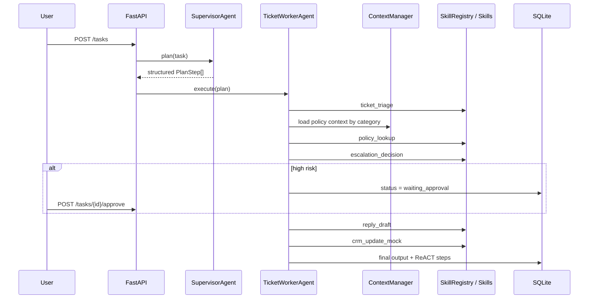

# Architecture

This project is intentionally small, but it keeps the core Agent boundaries visible.

## Components

- `SupervisorAgent` in `app/planner.py`: turns a task into structured `PlanStep` objects.
- `AgentExecutor` in `app/agent.py`: executes the plan, handles approval, retry, state transition and final output.
- `SkillRegistry` in `app/skills.py`: stores modular business capabilities with type, phase, schema and capability metadata.
- `ContextManager` in `app/context.py`: loads context progressively by task phase and triage category.
- `MemoryStore` in `app/memory.py`: provides a tiny long-term memory abstraction for customer profile recall.
- `Storage` in `app/storage.py`: persists tasks and execution steps in SQLite.

## Execution Chain

## Why This Is Not Just RAG

RAG is only represented by the `policy_lookup` skill. The main architecture is task execution: planning, skill selection, context control, tool execution, approval boundaries, state persistence and traceable output.
